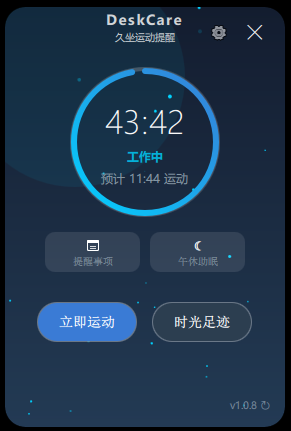
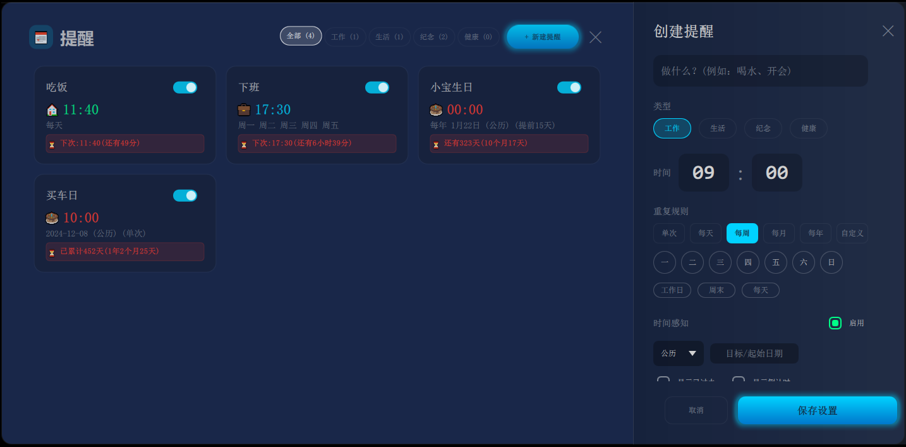
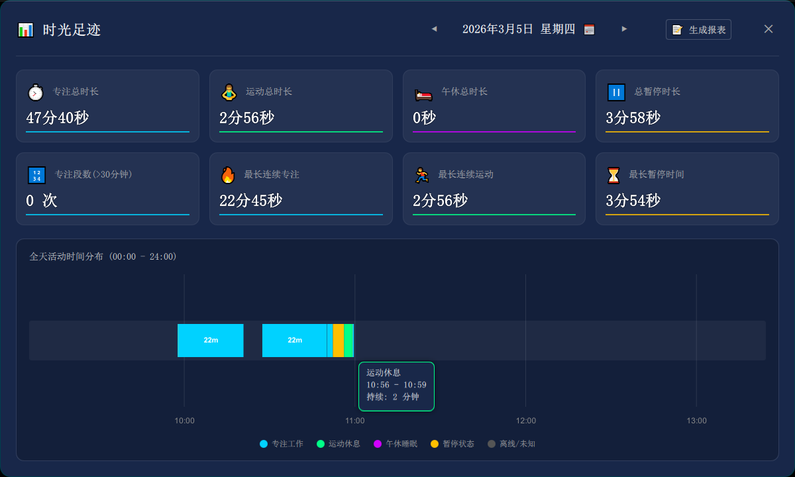

# DeskCare 新用户使用指南

适用版本：v1.0.7（界面可能随版本迭代略有差异，以实际显示为准）

---

## 0. 3 分钟快速上手

1. **找到它**：DeskCare 启动后常驻系统托盘（右下角小图标）。
2. **打开主界面**：单击或双击托盘图标，弹出主设置界面（见图1）。
3. **理解它的核心节奏**：默认每 **45 分钟**提醒你起来活动；你也可以在设置里改成 1–120 分钟。
4. **当提醒弹出时怎么做**：
   - 选择 **完成运动**：记录本次运动时长，并自动开始下一轮倒计时。
   - 选择 **稍后提醒**：推迟 **5 分钟**再提醒（若开启了强制运动，则不可推迟）。
5. **想临时不被打扰**：开启 **午休助眠**（见图1/图4的入口），屏幕进入全黑护眼模式。

---

## 1. 界面总览（建议先看图）

> 一图胜千言：本文档预留了 4 张截图位（图1–图4）。
>  
> 如果你手头已有截图，请将它们放到本指南同级目录下的 `img/` 目录，并按下列文件名保存：
> - `img/图1-主设置界面.png`
> - `img/图2-提醒事项界面.png`
> - `img/图3-时光足迹界面.png`
> - `img/图4-迷你模式悬浮球.png`

### 图1：主设置界面（Normal 模式）

你会经常用到的区域：
- **圆环倒计时**：显示距离下次提醒的剩余时间；下方给出“预计运动”时间点。
- **提醒事项**：进入提醒事项管理（图2）。
- **午休助眠**：一键进入午休模式（图4也可触发）。
- **立即运动**：立刻弹出“运动结算”流程（相当于手动触发一次休息提醒）。
- **时光足迹**：打开你的“专注/运动/午休/暂停”等时间分布与统计（图3）。
- **右上角按钮**：
  - `⚙` 偏好设置（间隔时长、开机自启、强制运动等）。
  - `×` 关闭主窗口：**不会退出**，只是隐藏到托盘。

### 图2：提醒事项界面（Schedule）

核心能力：按类型（工作/生活/纪念/健康）管理提醒；支持单次、每天、每周、每月、每年、以及自定义间隔；还支持“时间感知”（已过去/倒计时）等高级显示。

### 图3：时光足迹界面（Activity）

核心能力：用一眼看懂的方式呈现你的一天（以及过去 7 天）的专注/运动/午休/暂停分布，并支持报表生成。

### 图4：迷你模式悬浮球（Mini / 悬浮球）

核心能力：把 DeskCare 收进一个小圆球，常驻桌面，随手点击/双击/三击/四击完成常见操作（见第 6 节快捷方式）。

---

## 2. 久坐提醒：你每天最重要的功能

### 2.1 工作倒计时怎么计算

- DeskCare 会以“工作会话”的方式倒计时，到 0 时弹出全屏提醒。
- 默认间隔为 **45 分钟**；你可以在偏好设置里调整到 **1–120 分钟**。
- 倒计时过程中可随时暂停/继续，也可重置为当前设置的间隔重新开始。

### 2.2 触发提醒后怎么操作（全屏提醒）

当倒计时结束，会弹出全屏提醒窗口，底部有两个关键按钮：
- **完成运动**：记录本次运动时长，并进入结算展示；随后自动开始下一轮工作倒计时。
- **稍后提醒**：推迟 **5 分钟**再提醒。

强制运动（可选）：
- 若你在偏好设置里开启了 **强制运动**，则提醒出现后需要坚持到设定时长结束，才允许点击“完成运动”；同时“稍后提醒”将不可用。

### 2.3 手动触发“立即运动”

你不必等倒计时结束：
- 在主界面点击 **立即运动**，可立刻进入一次“运动结算”流程。
- 在悬浮球上 **三击**也可触发（见第 6 节）。

---

## 3. 午休助眠：办公室的“熄灯模式”

### 3.1 如何进入

任选一种方式：
- 主界面点击 **午休助眠**（图1）。
- 悬浮球上 **四击**（图4）。
- 托盘菜单选择 **☾ 午休模式**。

进入午休后：
- 主久坐倒计时会被暂停。
- 屏幕进入全黑护眼显示，只有低亮时钟与“勿扰提示”。

### 3.2 如何退出（防误触设计）

- 在午休界面 **长按屏幕 2 秒**退出（鼠标按住不放即可）。

---

## 4. 提醒事项：把重要的事交给 DeskCare 记

### 4.1 打开提醒事项（图2）

任选一种方式：
- 主界面点击 **提醒事项**卡片（图1）。
- 悬浮球右键菜单里选择 **提醒事项**（仅迷你模式下可见，见第 6 节）。

关闭方式：
- 点击右上角 `×` 关闭。
- 或直接按 `Esc`。

### 4.2 新建提醒：推荐的最小配置

创建一个可用提醒，通常只需要：
- **标题**：做什么？（例如：喝水、开会）
- **类型**：工作/生活/纪念/健康（决定配色与风格）
- **时间**：HH:mm
- **重复规则**：单次 / 每天 / 每周 / 每月 / 每年 / 自定义
- 点击 **保存设置**

### 4.3 重复规则说明（把复杂规则讲简单）

- **单次**：只在指定日期提醒一次。
- **每天**：每天同一时间提醒。
- **每周**：可勾选周一到周日；也支持“一键选择工作日/周末/每天”。
- **每月**：可选“最后一天”或输入几号（1–31）。
- **每年**：输入月/日；支持 **农历**；支持 **提前 N 天提醒**（适合纪念日准备礼物）。
- **自定义**：每 N 周/天/小时/分钟，从某个起始日期开始循环。

### 4.4 时间感知（高级但很实用）

在右侧面板开启 **时间感知**后，你可以让提醒卡片带上“心理计时器”：
- **显示已过去**：适合生日、在一起多少天、戒断第几天等。
- **显示倒计时**：适合考试、截止日期、项目里程碑等。
- **每日播报**：倒计时类提醒可每天提示一次（仅在开启倒计时时显示）。
- **到期后自动切换为“已过去”**：倒计时结束后自动进入“已过去”模式。

### 4.5 提醒弹窗怎么用（桌面卡片）

提醒触发后，会以桌面“提醒卡片”的形式出现在屏幕右上角（多显示器会分别出现）。

按钮说明：
- **我知道了**：关闭本次提醒。
- **推迟 X 分**：推迟再提醒（默认 5 分钟）。
  - 鼠标放在该按钮上滚动滚轮，可把 X 调整到 **1–10 分钟**。

可选能力：
- 在偏好设置中开启 **弹幕提醒** 后，会出现“弹幕式提醒”，同时仍保留提醒卡片作为主要交互入口。

---

## 5. 时光足迹：把你的专注与休息“可视化”

### 5.1 如何打开（图3）

任选一种方式：
- 主界面点击 **时光足迹**（图1）。
- 悬浮球右键菜单选择 **时光足迹**（图4，见第 6 节）。

### 5.2 你能看到什么

- 顶部统计卡：当天专注/运动/午休/暂停等核心汇总。
- 时间轴分布：00:00–24:00 的状态分布图，帮助你定位“高效段”和“容易走神段”。
- 图例颜色通常对应：
  - 专注工作（蓝）
  - 运动休息（绿）
  - 午休（紫）
  - 暂停（黄）
  - 离线/未知（灰）

### 5.3 常用交互（时间轴）

- **鼠标悬停**：显示该时间段的状态、起止时间与持续时长。
- **滚轮缩放**：以鼠标所在位置为中心放大/缩小时间轴视图。
- **按住拖拽**：左右平移当前视图窗口。
- **双击**：
  - 双击专注工作段：打开该段的工作日志详情（若该段支持）。
  - 双击空白处：重置缩放回 0–24 小时全览。

---

## 6. 悬浮球与快捷方式：越用越顺手

### 6.1 进入/退出迷你模式（悬浮球）

- **双击圆环**：在 Normal 模式与 Mini 模式间切换。
- 托盘启动为开机自启时：默认直接进入悬浮球，并定位到屏幕右上方。

### 6.2 悬浮球的右键快捷菜单（仅迷你模式）

- **右键单击悬浮球**：弹出快捷菜单，包含：
  - 暂停计时 / 继续计时（单击）
  - 切换模式（双击）
  - 立即运动（三击）
  - 午休助眠（四击）
  - 时光足迹
  - 提醒事项

### 6.3 快捷方式速查表（建议收藏）

| 场景 | 手势/操作 | 结果 |
|---|---|---|
| 主界面圆环 / 悬浮球 | 单击 | 暂停计时 / 继续计时 |
| 主界面圆环 / 悬浮球 | 双击 | 切换 Normal / 悬浮球 |
| 主界面圆环 / 悬浮球 | 三击 | 立即运动（立刻弹出运动提醒流程） |
| 主界面圆环 / 悬浮球 | 四击 | 进入午休助眠 |
| 悬浮球（仅迷你模式） | 右键单击 | 打开右键快捷菜单 |
| 悬浮球（仅迷你模式） | 右键双击 | 手动触发“整点报时”特效 |
| 提醒事项界面 | `Esc` | 关闭窗口 |
| 提醒卡片（提醒事项触发） | 滚轮（悬停在“推迟 X 分”） | 调整推迟时间（1–10 分） |

---

## 7. 偏好设置：把 DeskCare 调到“最适合你”

在主界面点击右上角 `⚙` 打开偏好设置，你会看到这些关键项：

- **开机自启**：建议开启，减少“忘记打开”的概率。
- **整点报时**：开启后，DeskCare 会在整点触发报时动效（仅在悬浮球模式下可见）。
- **弹幕提醒**：更轻量的提醒方式（不打断专注），同时保留提醒卡片作为可操作入口。
- **间隔时长**：
  - 点击 `+/-` 调整分钟数；
  - 在分钟数上滚动滚轮可快速微调；
  - 单击分钟数可按当前设置 **立即重置并开始新一轮倒计时**。
- **强制运动**：开启后，提醒弹出时需要坚持到设定时长结束，才允许“完成运动”。
- **强制时长**：1–5 分钟（仅在强制运动开启时显示）。

---

## 8. 托盘与退出：别把“隐藏”当成“退出”

### 8.1 托盘交互

- **单击/双击托盘图标**：唤起主界面。
- **右键托盘图标**：打开托盘菜单，包含：
  - 开始专注 / 暂停计时
  - 跳过休息 / 重置计时
  - 午休模式（可切换为“结束午休”）
  - 检查更新
  - 退出程序

### 8.2 真正退出程序

- 请用托盘菜单里的 **🚪 退出程序** 退出。
- 主界面右上角 `×` 只会隐藏窗口到托盘，不会退出。

---

## 9. 推荐使用姿势（从“安装好”到“用顺手”）

- **第一天**：只做三件事——开启开机自启、把间隔调成你能接受的值、学会单击暂停/继续。
- **第一周**：开始用“提醒事项”把固定的事交给它（喝水/会议/拉伸/眼保健操）。
- **第二周**：每天打开一次“时光足迹”，看看你的专注/休息节奏是否健康。
- **长期**：需要强约束时再开启“强制运动”，否则保持低打扰更容易坚持。

---

## 10. 常见问题（FAQ）

### 10.1 我点了右上角 `×`，软件怎么“不见了”？

- `×` 只是**隐藏窗口到托盘**，软件仍在后台运行。
- 到任务栏右下角托盘区找到 DeskCare 图标，单击/双击即可重新打开主界面。

### 10.2 主界面/悬浮球可以拖动吗？

- 可以。按住窗口区域拖拽即可移动（包含圆环区域）。

### 10.3 为什么提醒卡片不会自动消失？

- 提醒卡片设计为“**持久提醒**”，避免你错过重要事项；需要你主动点击“我知道了”或“推迟 X 分”。

### 10.4 多显示器下提醒在哪里？

- 全屏久坐提醒会在**每个屏幕**弹出。
- 提醒事项的提醒卡片也会在**每个屏幕**右上角出现，并自动上下堆叠避免遮挡。

### 10.5 “弹幕提醒”和“提醒卡片”有什么区别？

- 弹幕提醒偏“轻量提示”，适合不想被打断的场景。
- 提醒卡片提供明确按钮（我知道了/推迟 X 分），更适合需要处理闭环的提醒。

### 10.6 午休模式怎么退出？

- 午休界面**长按屏幕 2 秒**即可退出。
